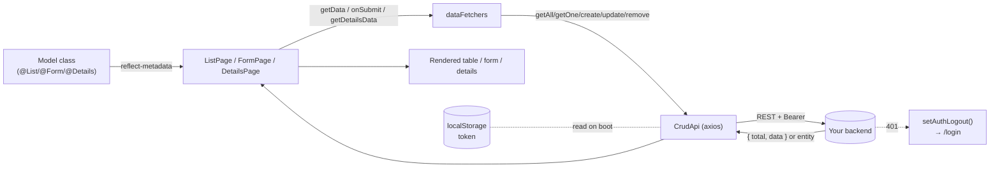

# How To — `proje-react-panel`

A decorator-driven admin-panel kit for React. You declare your resources as TypeScript classes (`@List`, `@Form`, `@Details`); the library renders the table / form / detail pages and talks to your REST backend.

For deep walkthroughs see [`guides/IMPLEMENTATION_GUIDE.md`](./guides/IMPLEMENTATION_GUIDE.md). For a runnable demo see [`examples/`](./examples).

---

## 1. What you're getting

- `<ListPage model={...} />`, `<FormPage model={...} />`, `<DetailsPage model={...} />` — page components driven by class metadata.
- `<Panel>`, `<Layout>`, `<Login>` — app shell, sidebar, and login page.
- `<Dashboard>`, `<DashboardGrid>`, `<DashboardItem>`, `<Counter>` — dashboard widgets.
- `initApi`, `setAuthToken`, `getAll`, `getOne`, `create`, `update`, `remove`, `createFormData`, `updateFormData` — backend wiring helpers.
- Decorators: `@List`, `@Form`, `@Details`, `@Cell`, `@LinkCell`, `@ImageCell`, `@DownloadCell`, `@Input`, `@SelectInput`, `@RichTextInput`, `@CustomInput`, `@DetailsItem`.

See the full export surface in [`src/index.ts`](./src/index.ts).

---

## 2. Backend expectations

The library is built against a plain REST backend with these conventions. Any backend that respects them will work — a compatible NestJS reference implementation is available as a sibling project; use it as a starting point if you don't have a backend yet.

| Concern     | Shape                                                                  |
| ----------- | ---------------------------------------------------------------------- |
| Auth header | `Authorization: Bearer <jwt>` on every protected request               |
| Login       | `POST /auth/login` → `{ access_token, admin: { id, email } }`          |
| List        | `GET /:resource?page=<n>&limit=<n>` → `{ total: number, data: T[] }`   |
| Item        | `GET /:resource/:id` → entity JSON (no envelope)                       |
| Mutations   | `POST /:resource`, `PUT /:resource/:id`, `DELETE /:resource/:id`       |
| File upload | `multipart/form-data`, field name `file`                               |
| Errors      | `{ statusCode, message, error }` (NestJS default works out of the box) |
| 401         | The library auto-clears the token and redirects to `/login`            |

---

## 3. Client-side data flow



---

## 4. Quick start (5 steps)

### 4.1 Install

```bash
npm install proje-react-panel \
  react react-router react-hook-form \
  zustand axios react-select use-sync-external-store
```

Peer-dep versions: `react >= 19`, `react-router 7.3.0`, `react-hook-form >= 7.54.2`, `zustand >= 5.0.3`, `axios >= 1.0.0`, `react-select ^5.10.1`, `use-sync-external-store >= 1.4.0` (see [`package.json`](./package.json)).

Rich text (`@RichTextInput`) needs two more packages, and only if you use it — they are declared **optional** peer dependencies, so npm/yarn will not pull them into panels that have no richtext field:

```bash
npm install @tiptap/react @tiptap/starter-kit
```

### 4.2 Initialize at app root

```ts
import { Panel, initApi, initAuthToken, setAuthToken } from 'proje-react-panel';
import 'reflect-metadata';

initApi({ baseUrl: import.meta.env.VITE_API_BASE_URL });
initAuthToken();

export function App() {
  return (
    <Panel onInit={(appData) => { if (appData.token) setAuthToken(appData.token); }}>
      <Router>{/* routes */}</Router>
    </Panel>
  );
}
```

### 4.3 Wire data fetchers

```ts
// src/api/dataFetchers.ts
import { getAll, getOne, create, update, remove } from 'proje-react-panel';
import { ProductList, CreateProductForm, EditProductForm, ProductDetails } from '../models/Product';

export const dataFetchers = Object.freeze({
  products: {
    getAll: getAll<ProductList>('products'),
    details: getOne<ProductDetails>('products'),
    create: create<CreateProductForm>('products'),
    update: update<EditProductForm>('products'),
    remove: remove('products', 'id'),
  },
});
```

### 4.4 Declare a model with decorators

```ts
// src/models/Product.ts
import { List, Cell, LinkCell, Form, Input, Details, DetailsItem } from 'proje-react-panel';
import { IsNotEmpty, MinLength } from 'class-validator';
import { dataFetchers } from '../api/dataFetchers';

@List({ getData: dataFetchers.products.getAll, primaryId: 'id' })
export class ProductList {
  @Cell({ title: 'ID', type: 'uuid' }) id!: string;
  @Cell({ title: 'Name' }) name!: string;
  @LinkCell({ path: '/products/:id', placeHolder: 'open' }) open!: string;
}

@Form({ onSubmit: dataFetchers.products.create, redirectSuccessUrl: '/products' })
export class CreateProductForm {
  @Input({ label: 'Name' })
  @IsNotEmpty()
  @MinLength(2)
  name!: string;
}

@Details({ getDetailsData: dataFetchers.products.details, primaryId: 'id' })
export class ProductDetails {
  @DetailsItem() id!: string;
  @DetailsItem() name!: string;
}
```

### 4.4.1 Page size

`ListPage` asks for as many rows as fit the datagrid, instead of a fixed page size. It measures the
grid element (so your own shell CSS is accounted for) and divides by the row height — which is
declared, not measured, and then applied to the row, so the number cannot drift from what is on
screen:

```ts
// Default: auto page size, library row height, nothing to declare.
@List({ getData: dataFetchers.products.getAll, primaryId: 'id' })

// A list with taller rows (an image cell, or your own row CSS) declares its height.
@List({ getData: dataFetchers.products.getAll, primaryId: 'id', rowHeight: 124 })

// Opt out: `getData` (or the server) decides the page size, as before.
@List({ getData: dataFetchers.products.getAll, primaryId: 'id', autoCalculate: false })
```

The computed size is sent as `limit`, so the backend contract in §2 is unchanged. It is clamped to
5–100 rows, and recomputed on window resize.

---

### 4.5 Route the pages

```tsx
import { ListPage, FormPage, DetailsPage } from 'proje-react-panel';
import { ProductList, CreateProductForm, ProductDetails } from './models/Product';

<Route path="products">
  <Route path="" element={<ListPage model={ProductList} />} />
  <Route path="create" element={<FormPage model={CreateProductForm} />} />
  <Route path=":id" element={<DetailsPage model={ProductDetails} />} />
</Route>;
```

That's it — you have a fully functional list / create / detail flow against `GET|POST|GET /products`.

---

## 5. File uploads

Swap `create` → `createFormData` (and `update` → `updateFormData`) in your `dataFetchers`, set `type: 'formData'` on the `@Form` decorator, and name the file field `file`. The library then sends `multipart/form-data` with the file under the `file` key — which is what the reference backend's upload endpoint expects.

A complete worked example lives in [`examples/src/models/Asset.ts`](./examples/src/models/Asset.ts) and [`examples/src/api/dataFetchers.ts`](./examples/src/api/dataFetchers.ts).

---

## 6. Form field types

Beyond `@Input`, a field can opt into a richer control. Each decorator is a drop-in replacement for `@Input` on the property.

### 6.1 `@SelectInput` — dropdown

```ts
@Form({ onSubmit: dataFetchers.products.create })
export class CreateProductForm {
  @SelectInput({ label: 'Category', defaultOptions: [{ label: 'Books', value: 'books' }] })
  category!: string;

  @SelectInput({
    label: 'Owner',
    onSelectPreloader: async () => (await listUsers()).map(u => ({ label: u.email, value: u.id })),
  })
  ownerId!: string;
}
```

| Option              | Meaning                                                                 |
| ------------------- | ----------------------------------------------------------------------- |
| `defaultOptions`    | Options known up front                                                  |
| `onSelectPreloader` | `async () => { label, value }[]`, fetched once and cached across fields |

### 6.2 `@RichTextInput` — rich text

Renders a TipTap editor and stores **HTML** in the field. Requires the optional peers from §4.1; without them the field renders an "install these packages" notice and the rest of the panel keeps working.

```ts
import { Form, Input, RichTextInput } from 'proje-react-panel';

@Form({ onSubmit: dataFetchers.articles.create })
export class CreateArticleForm {
  @Input({ label: 'Title' })
  title!: string;

  @RichTextInput({
    label: 'Body',
    placeholder: 'Write the article…',
    toolbar: ['bold', 'italic', 'heading', 'bulletList', 'orderedList', 'link'],
    minHeight: 240,
  })
  body!: string;
}
```

| Option        | Meaning                                                                                                                  |
| ------------- | ------------------------------------------------------------------------------------------------------------------------ |
| `toolbar`     | Buttons to show, in order — any of `bold`, `italic`, `heading`, `bulletList`, `orderedList`, `link`. Defaults to all six |
| `minHeight`   | Editor height in px (default `160`)                                                                                      |
| `placeholder` | Shown while the document is empty                                                                                        |

Notes:

- The value is an HTML string (`<p>…</p>`); an empty editor reports `''`, so `@IsNotEmpty()` behaves as expected.
- Values loaded through `@Form({ getDetailsData })` arrive after the form mounts; the editor picks them up without disturbing a caret that is already in the text.

### 6.3 `@CustomInput` — anything else

```ts
@CustomInput({ label: 'Color', render: ({ value, onChange }) => <ColorPicker value={value} onChange={onChange} /> })
color!: string;
```

---

## 7. Grouping form fields

Long forms can be split into sections. Fields opt in with `group`, and `@Form({ groups })` decides the headings and their order:

```ts
@Form({
  onSubmit: dataFetchers.articles.create,
  groups: [
    { key: 'content', label: 'Content' },
    { key: 'seo', label: 'SEO', collapsible: true },
    { key: 'advanced', label: 'Advanced', collapsible: true, defaultCollapsed: true },
  ],
})
export class CreateArticleForm {
  @Input({ label: 'Title', group: 'content' })
  title!: string;

  @RichTextInput({ label: 'Body', group: 'content' })
  body!: string;

  @Input({ label: 'Meta description', type: 'textarea', rows: 4, group: 'seo' })
  metaDescription!: string;

  @Input({ label: 'Cache key', group: 'advanced' })
  cacheKey!: string;
}
```

| Group option       | Meaning                                                          |
| ------------------ | ---------------------------------------------------------------- |
| `key`              | Matched against `@Input({ group })`                              |
| `label`            | Section heading                                                  |
| `collapsible`      | Renders as `<details>/<summary>` instead of `<fieldset><legend>` |
| `defaultCollapsed` | Starts closed (collapsible groups only)                          |

Rules worth knowing:

- **A form where no field sets `group` renders exactly as before** — no extra wrapper element, so existing panel CSS is untouched.
- Fields without a `group` render first, above the sections, in declaration order.
- A `group` value missing from `@Form({ groups })` still renders: it is appended after the declared sections and labelled with its own key.
- `hidden` fields never go into a section.
- `rows` works on any `type: 'textarea'` field, grouped or not.

---

## 8. Login & 401

- `initAuthToken()` reads `localStorage["token"]` on boot and applies it to axios.
- `setAuthToken(token)` writes the token to `localStorage` and axios defaults — call it from your login form's success handler (or use the built-in `<Login model={DefaultLoginForm} />`).
- A 401 response anywhere triggers `setAuthLogout()` and a hard redirect to `/login`. See [`src/api/ApiConfig.ts`](./src/api/ApiConfig.ts) for the interceptor.

---

## 9. Where to next

| Topic                                      | File                                                                 |
| ------------------------------------------ | -------------------------------------------------------------------- |
| Step-by-step walkthrough (the deepest doc) | [`guides/IMPLEMENTATION_GUIDE.md`](./guides/IMPLEMENTATION_GUIDE.md) |
| Sidebar + authenticated layout             | [`guides/AUTH_LAYOUT_GUIDE.md`](./guides/AUTH_LAYOUT_GUIDE.md)       |
| Layout example code                        | [`guides/AUTH_LAYOUT_EXAMPLE.md`](./guides/AUTH_LAYOUT_EXAMPLE.md)   |
| Dashboard widgets                          | [`guides/DASHBOARD_GUIDE.md`](./guides/DASHBOARD_GUIDE.md)           |
| Colors / theme tokens                      | [`guides/COLOR_SYSTEM_GUIDE.md`](./guides/COLOR_SYSTEM_GUIDE.md)     |
| Feature overview                           | [`guides/USAGE.md`](./guides/USAGE.md)                               |
| Live runnable example                      | [`examples/`](./examples)                                            |
| Product/tech doc                           | [`PTD.md`](./PTD.md)                                                 |

---

## 10. Version & license

`proje-react-panel` v1.9.0 — ISC license. See [`package.json`](./package.json).
